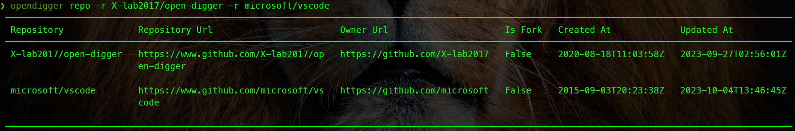
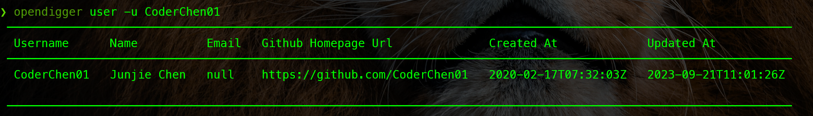
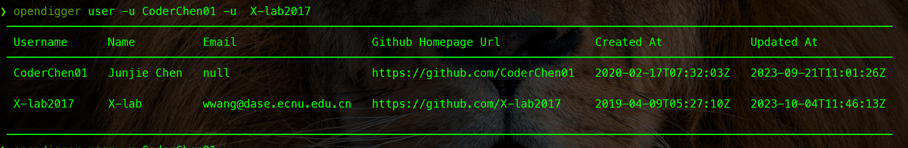
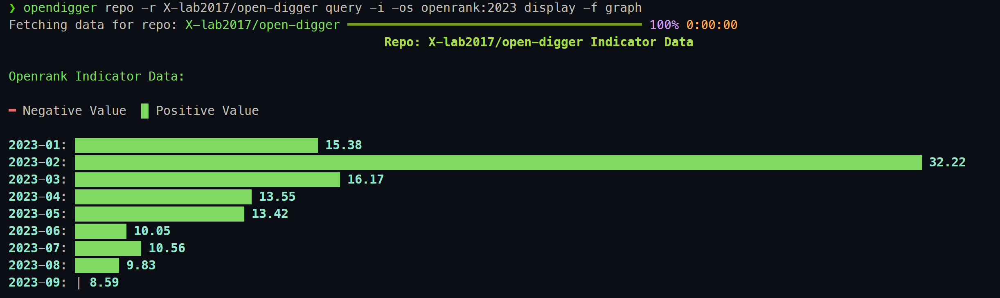
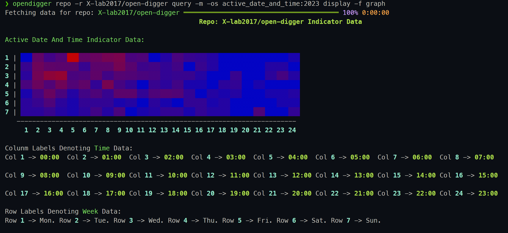

# OpenDigger CLI

[中文README](./README_CN.md)

---

[](https://github.com/X-lab2017/open-digger)
[](https://codecov.io/gh/CoderChen01/opendigger-pycli)
[](https://github.com/CoderChen01/opendigger-pycli/actions/workflows/main.yml)

An extensible command-line tool that integrates GitHub open-source data query, export, visualization, and monitoring features for [OpenDigger](https://github.com/X-lab2017/open-digger).

## 🪄 Key Features

- **Flexible query capabilities** allowing users to filter individual indicators or query all at once.
- **Comprehensive data export** options, enabling users to export filtered or complete indicator data.
- **Extensible data visualization**, allowing users to select indicators for visualization and extend them through interfaces.
- **Automatic missing data feedback**, submitting an issue to developers when required data is unavailable.
- **Simple plugin system**, enabling users to extend custom functionalities via provided interfaces.
- **Integration with OpenAI GPT API**, generating insightful analysis alongside chart reports.

## 🗓️ TODO

- [x] Command-line parsing module
- [x] Command-line configuration module
- [x] Data retrieval module
- [x] Data query module
- [x] Data export module
- [x] Data feedback module
- [x] AI-generated data report module
- [x] Data visualization module

## 🪛 Installation

### Basic Environment

Python >= 3.8

### Install from Source

```bash
python3 -m pip install flit

git clone https://github.com/CoderChen01/opendigger-pycli.git

flit install
# For details, see: https://github.com/pypa/flit
```

### Install from PyPI

```bash
pip3 install opendigger_pycli
```

## 🕹️ Basic Usage

### Enable Auto-completion

For zsh:

```zsh
eval "$(_OPENDIGGER_COMPLETE=zsh_source opendigger)"
```

For bash:

```bash
eval "$(_FOO_BAR_COMPLETE=bash_source opendigger)"
```

### Get GitHub Personal Access Token

GitHub Personal Access Token is required to access the GitHub API and retrieve repository and user information.

[Click here](https://github.com/settings/tokens?type=beta) to generate.

Steps:

1. Click `Fine-grained tokens` > `Generate new token`
2. Set `Token name` and `Token Expiration`
3. Select repository permissions
4. Set issue read/write permissions (metadata must also be set to read-only)

### Get OpenAI Key

The OpenAI key is needed to access the OpenAI API for data analysis and insight generation.

[Click here](https://beta.openai.com/account/api-keys) to obtain.

### `config` Command

The `config` command is used to configure API keys and basic user information for the tool. Currently, the tool requires GitHub API and OpenAI API keys. The GitHub API key is used to query repositories and user information, while the OpenAI API key is used to analyze indicator data and generate insight reports.

The command accepts one parameter:

- `-s / --set`: Used to set configuration items (this parameter can be used multiple times).

Usage examples:

```bash
# Configure GitHub API key
opendigger config --set app_keys.github_pat <your_pat>

# Configure OpenAI API key
opendigger config -s app_keys.openai_key <your_key>

# Configure both user name and email
opendigger config -s user_info.name <your_name> -s user_info.email <your_email>
```

<details>
<summary> Demo Recording </summary>


</details>

---

### `repo` Command

The `repo` command is used to view indicator data for a repository. It accepts the following parameter:

- `-r / --repo`: Specifies the repository name (this parameter can be used multiple times).

If multiple repositories are specified, it will query data for all of them.

When used alone, it retrieves basic repository information, including the repository homepage link, owner homepage link, whether the repository is a fork, creation time, and last update time. **This information helps users quickly understand the repository's general status.**

Usage examples:

```bash
# Query basic information of a single repository
opendigger repo -r X-lab2017/open-digger

# Query basic information of multiple repositories
opendigger repo -r X-lab2017/open-digger -r microsoft/vscode
```

<details>
<summary> Screenshots </summary>



</details>

<details>
<summary> Demo Recording </summary>


</details>

---

### `user` Command

The `user` command is used to view indicator data for a GitHub user. It accepts the following parameter:

- `-u / --username`: Specifies the GitHub username (this parameter can be used multiple times).

If multiple usernames are specified, it will query data for all of them.

When used alone, it retrieves basic user information, including username, nickname, email, homepage link, account creation time, and last update time. **This information helps users quickly understand a user's general status.**

Usage examples:

```bash
# Query basic information of a single user
opendigger user -u CoderChen01

# Query basic information of multiple users
opendigger user -u CoderChen01 -u X-lab2017
```

<details>
<summary> Screenshots </summary>




</details>

---

### `query` Command

The `query` command is a subcommand of `repo` and `user` (⚠️ The `query` command must be used after `repo` or `user`), and it is used to filter indicator data for repositories or users.

Currently supported filters:

- Filter indicators by type
- Filter indicator data by time
- Filter a specific indicator by time
- Positive indicator filtering
- Negative indicator filtering

Available parameters for the `query` command:

```text
-i, --index                     Select indicators of type INDEX.
-m, --metric                    Select indicators of type METRIC.
-n, --network                   Select indicators of type NETWORK.
-x, --x-lab                     Select indicators introduced by X-lab.
-c, --chaoss                    Select indicators introduced by CHAOSS.
-s, --select INDICATOR_QUERY    The indicator to select.
-o, --only-select / -N, --no-only-select
                                Only query selected indicators.
-I, --ignore IGNORED_INDICATOR_NAMES
                                The indicators to ignore.
-f, --filter INDICATOR_QUERY   The query applying to all indicators.
```

The `query` command has two subcommands:

- `display`: Used to display filtered data in table, graph, or JSON format in the terminal.
- `export`: Used to export filtered data into AI-generated reports or raw JSON format.

⚠️ **Important Note:**  
The `query` command acts as a data retriever. It downloads the specified data from the OpenDigger data repository based on user-provided parameters.  
However, **the `query` command itself does not process the data**—it only downloads and filters it.  

To process the data, users must use the `display` or `export` subcommands.  
If no `display` or `export` subcommand is used, the `query` command will only output metadata about the filtered indicators.  

Additionally, developers can use the provided API to access filtered `query` data and develop custom commands. For more details, see [🔌 Plugin Development](#plugin-development).

---

#### Filter Indicators by Type

When the `query` command is used **without any parameters**, it outputs metadata for all supported indicators, including indicator names, types, introducers, and sample data links.

Example:

```bash
# View metadata of repository indicators
opendigger repo -r X-lab2017/open-digger query
```

<details>
<summary> Demo Recording </summary>


</details>

To view metadata of a specific type of indicator, use `-i`, `-m`, and `-n`:

```bash
# View metadata for index-type indicators
opendigger repo -r X-lab2017/open-digger query -i
# or
opendigger repo -r X-lab2017/open-digger query --index

# View metadata for metric-type indicators
opendigger repo -r X-lab2017/open-digger query -m

# View metadata for network-type indicators
opendigger repo -r X-lab2017/open-digger query -n
```

To filter by introducer, use `-x` and `-c`:

```bash
# View indicators introduced by X-lab
opendigger repo -r X-lab2017/open-digger query -x

# View indicators introduced by CHAOSS
opendigger repo -r X-lab2017/open-digger query -c
```

You can also combine these parameters:

```bash
# View metric-type indicators introduced by X-lab
opendigger repo -r X-lab2017/open-digger query -m -x

# View metric-type indicators introduced by CHAOSS
opendigger repo -r X-lab2017/open-digger query -m -c
```

---

#### Filter Indicator Data by Time

To filter indicator data by time, use the `-f` parameter with a **time range expression**.

Time filtering examples:

```bash
# View index-type indicators for 2023 in table format
opendigger repo -r X-lab2017/open-digger query -i -f 2023 display -f table

# View index-type indicators for 2021-2023 in table format
opendigger repo -r X-lab2017/open-digger query -i -f 2021~2023 display -f table
```

<details>
<summary> Demo Recording </summary>


</details>

### Filter a Specific Indicator by Time

To filter a specific indicator by time, use the `-s` parameter. This parameter accepts an **indicator query expression** in the format:  

```
indicator_name:time_filter
```

Examples:

```bash
# View the `openrank` indicator data for 2023 in table format
opendigger repo -r X-lab2017/open-digger query -i -s openrank:2023 display -f table

# View the `openrank` indicator data for 2021-2022 in table format
opendigger repo -r X-lab2017/open-digger query -i -s openrank:2021~2022 display -f table

# View the `openrank` indicator data for March 2021 to March 2022 in table format
opendigger repo -r X-lab2017/open-digger query -i -s openrank:2021-03~2022-03 display -f table

# View the `openrank` indicator data for past years (March to August) in table format
opendigger repo -r X-lab2017/open-digger query -i -s openrank:3~8 display -f table
```

<details>
<summary> Demo Recording </summary>


</details>

---

### Positive Indicator Filtering

If too many indicators are returned, use the `-o / --only-select` option to **filter only specific indicators**.

Example:

```bash
# View only `openrank` data for past years (March to August)
opendigger repo -r X-lab2017/open-digger query -i -s openrank:3~8 -o display -f table
```

<details>
<summary> Demo Recording </summary>


</details>

To filter multiple indicators:

```bash
# View only `openrank` (March to August) and `issue_age` (May to August)
opendigger repo -r X-lab2017/open-digger query -s openrank:3~8 -s issue_age:5~8 -o display -f table
```

---

### Negative Indicator Filtering

To **exclude specific indicators**, use the `-I / --ignore` parameter.

Example:

```bash
# View all index-type indicators, excluding `openrank`
opendigger repo -r X-lab2017/open-digger query -i -I openrank display -f table
```

---

## `display` Command

The `display` command is a subcommand of `query`, allowing users to visualize data in **table, chart, or JSON format**.

Supported parameters:

```text
-f, --format [table|graph|json]  # Required display format
-s, --save DIRECTORY             # Save output as a simple report
-p, --paging / --no-paging       # Paginate output (like 'more' or 'less')
-c, --pager-color / --no-pager-color  # Enable color in pager mode
```

### Table Format

Already demonstrated in previous examples.

### Chart Format

Example:

```bash
# View `openrank` indicator for 2023 as a bar chart
opendigger repo -r X-lab2017/open-digger query -i -os openrank:2023 display -f graph
```

Results:



For heatmaps:

```bash
# View `active_date_and_time` for 2023 as a heatmap
opendigger repo -r X-lab2017/open-digger query -m -os active_date_and_time:2023 display -f graph
```



### JSON Format

```bash
# View `issue_age` data in JSON format
opendigger repo -r X-lab2017/open-digger query -mos issue_age display -f json
```

<details>
<summary> Demo Recording </summary>


</details>

### Save Output Results

Save as a report:

```bash
opendigger repo -r X-lab2017/open-digger query display -f graph -s .
```

---

## `export` Command

The `export` command is used to save **AI-analyzed reports or raw JSON data**.

```text
-f, --format [report|json]  # Required format
-s, --save-dir DIRECTORY    # Required save location
--split / --no-split        # Save each indicator in a separate file (for JSON)
```

### Export Data Report

```bash
# Export AI-analyzed data report
opendigger repo -r X-lab2017/open-digger query export -f report -s .
```

[Demo Recording](./docs/assets/demos/repo-query-export-report.mp4)

### Export Raw JSON Data

```bash
# Export raw JSON data
opendigger repo -r X-lab2017/open-digger query export -f json -s .
```

---

## Combined Usage

Commands can be **combined**:

```bash
opendigger repo -r X-lab2017/open-digger query -ios openrank:2023 display -f table export -f json -s .
```

Results:


---

## 👀 Exception Handling

### Automatic Feedback for Missing Data

If data is missing, the tool **automatically submits a GitHub issue**.

Example issue:


### Repository Not Found

If a repository doesn't exist:

```bash
opendigger repo -r X-lab2017/open-digger-404
```


### User Not Found

If a user doesn't exist:

```bash
opendigger user -u CoderChen01-404
```


---

## 🔌 Plugin Development

### `query` Command Return Data

```python
@dataclass
class RepoQueryResult(BaseQueryResult):
    type: t.ClassVar[t.Literal["repo"]] = "repo"
    repo: t.Tuple[str, str]
    org_name: str = field(init=False)
    repo_name: str = field(init=False)

@dataclass
class UserQueryResult(BaseQueryResult):
    type: t.ClassVar[t.Literal["user"]] = "user"
    username: str
```

### Plugin Example

Custom command `print-result`:

```python
import click
from opendigger_pycli.console import CONSOLE
from opendigger_pycli.utils.decorators import processor

@click.command("print-result", help="[Plugin Demo] Print query result")
@processor
def print_result(results):
    CONSOLE.print(results)
    yield from results  # Required for command chaining
```

Module setup:

```python
from setuptools import setup

setup(
    name="opendigger_pycli_print_result",
    version="0.1",
    py_modules=["print_result"],
    entry_points="""
        [opendigger_pycli.plugins]
        print-result=print_result:print_result
    """,
)
```

### Using the Example Plugin

Install:

```bash
cd plugin_example/print_result
python3 setup.py install
```

Check if installed:

```bash
opendigger repo -r X-lab2017/open-digger query --help
```

Use it:

```bash
opendigger repo -r X-lab2017/open-digger query -ios openrank:2023 print-result
```

---

## 📄 Explanation of Filtering Expressions

- **2023** → Data from 2023
- **2021~2023** → Data from 2021-2023
- **3~8** → Data from March to August (any year)
- **2023-03** → Data from March 2023
- **2022-03~2023-03** → Data from March 2022 to March 2023

---

## End

For a GPT analysis demo, see:  
[./docs/assets/result_examples/export/report/repo-X-lab2017-open-digger](./docs/assets/result_examples/export/report/repo-X-lab2017-open-digger/)


