# OpenDigger CLI

[](https://github.com/X-lab2017/open-digger)
[](https://codecov.io/gh/CoderChen01/opendigger-pycli)
[](https://github.com/CoderChen01/opendigger-pycli/actions/workflows/main.yml)

一个可拓展的 [OpenDigger](https://github.com/X-lab2017/open-digger) GitHub开源数据查询、导出、可视化和监控等功能一体的命令行工具。

<details>

<summary> 目录 </summary>

- [OpenDigger CLI](#opendigger-cli)
  - [🗺️Big Picture](#️big-picture)
  - [🧾项目简介](#项目简介)
  - [🪄功能亮点](#功能亮点)
  - [🗓️TODO](#️todo)
  - [🪛安装](#安装)
    - [基本环境](#基本环境)
    - [从源码安装](#从源码安装)
    - [从PyPI安装](#从pypi安装)
  - [🕹️基本用法](#️基本用法)
    - [开启自动补全](#开启自动补全)
    - [获取Github Personal Access Token](#获取github-personal-access-token)
    - [获取OpenAI key](#获取openai-key)
    - [config 命令](#config-命令)
    - [repo 命令](#repo-命令)
    - [user 命令](#user-命令)
    - [query 命令](#query-命令)
      - [按类型筛选指标](#按类型筛选指标)
      - [按时间筛选指标数据](#按时间筛选指标数据)
      - [对某一指标进行时间筛选](#对某一指标进行时间筛选)
      - [正向筛选指标](#正向筛选指标)
      - [反向筛选指标](#反向筛选指标)
    - [display 命令](#display-命令)
      - [表格格式](#表格格式)
      - [图表格式](#图表格式)
      - [json格式](#json格式)
      - [保存输出结果](#保存输出结果)
    - [export 命令](#export-命令)
      - [数据报告](#数据报告)
      - [原始Json数据](#原始json数据)
    - [组合使用](#组合使用)
  - [👀异常处理](#异常处理)
    - [缺失数据自动反馈](#缺失数据自动反馈)
    - [仓库不存在](#仓库不存在)
    - [用户不存在](#用户不存在)
  - [🔌插件开发](#插件开发)
    - [query的返回数据](#query的返回数据)
    - [插件示例](#插件示例)
    - [示例插件使用](#示例插件使用)
  - [📄筛选条件表达式详解](#筛选条件表达式详解)
  - [End](#end)

</details>

## 🗺️Big Picture

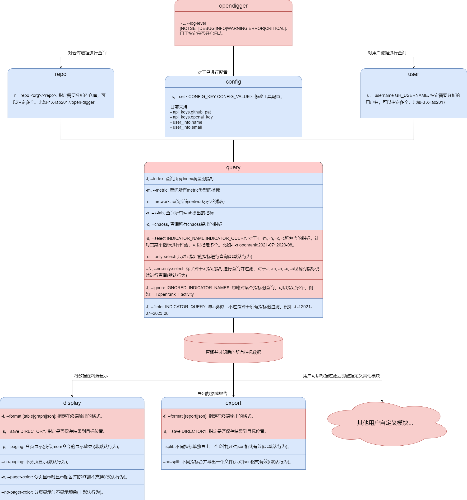

## 🧾项目简介

项目地址：[CoderChen01/opendigger-pycli](https://github.com/CoderChen01/opendigger-pycli); 本项目基于Github进行团队协作。

本项目来源于：[OpenSODA | OpenDigger 开源软件生态数据分析挖掘平台挑战赛](https://atomgit.com/x-lab/OpenSODA) [任务类（T）| T2：命令行交互的指标结果查询子模块](https://xlab2017.yuque.com/staff-kbz9wp/olpzth/bs86kmg94pbg9fu6)。

本项目所提交的复赛方案文档：[复赛-T2-ahpu_new_peasants.md](./docs/复赛-T2-ahpu_new_peasants.md)

本项目的详细介绍文档：[决赛-T2-ahpu_new_peasants.md](./docs/决赛-T2-ahpu_new_peasants.md)。

**如果您正在使用atomgit查看该项目请查看：**[决赛-T2-ahpu_new_peasants-autogit.md](./docs/决赛-T2-ahpu_new_peasants-autogit.md)。

本项目的演示视频：[OpenDigger CLI 演示视频](https://www.bilibili.com/video/BV1A8411y7UB)。

## 🪄功能亮点

- 提供**灵活的查询**功能，用户可以在查询所有指标的同时针对某个指标进行筛选，也可以只查询某个指标。
- 提供**灵活的数据导出**功能，用户可以将过滤的指标数据进行导出，也可以将所有指标数据进行导出。
- 提供**可拓展的数据可视化**功能，用户不仅可以选择需要可视化的指标，还可以通过接口拓展自定义的可视化指标。
- 提供**数据缺失自动反馈**功能，当用户所需数据不存在时，自动提交Issue给开发者。
- 实现了简易的**插件系统**，用户可以通过提供的接口拓展自定义的功能。
- 接入**OpenAI GPT API**，在导出图表报告的同时进行分析。

## 🗓️TODO

- [x] 命令行解析模块
- [x] 命令行配置模块
- [x] 数据获取模块
- [x] 数据查询模块
- [x] 数据导出模块
- [x] 数据反馈模块
- [x] 数据报告AI生成模块
- [x] 数据可视化模块

## 🪛安装

<a id="安装"></a>

### 基本环境

Python >= 3.8

### 从源码安装

```bash
python3 -m pip install flit

git clone https://github.com/CoderChen01/opendigger-pycli.git

flit install
# 详见：https://github.com/pypa/flit
```

### 从PyPI安装

```bash
pip3 install opendigger_pycli
```

## 🕹️基本用法

<a id="基本用法"></a>

### 开启自动补全

zsh:

```zsh
eval "$(_OPENDIGGER_COMPLETE=zsh_source opendigger)"
```

bash:

```bash
eval "$(_FOO_BAR_COMPLETE=bash_source opendigger)"
```

### 获取Github Personal Access Token

Github Personal Access Token用于访问Github API，获取Github API的权限。通过Github API我们可以获取到Github上的仓库和用户的基本信息和自动反馈缺失数据。

[点击这里](https://github.com/settings/tokens?type=beta) 获取。

具体步骤：

1.点击`Fine-grained tokens` > 点击`Generate new token`

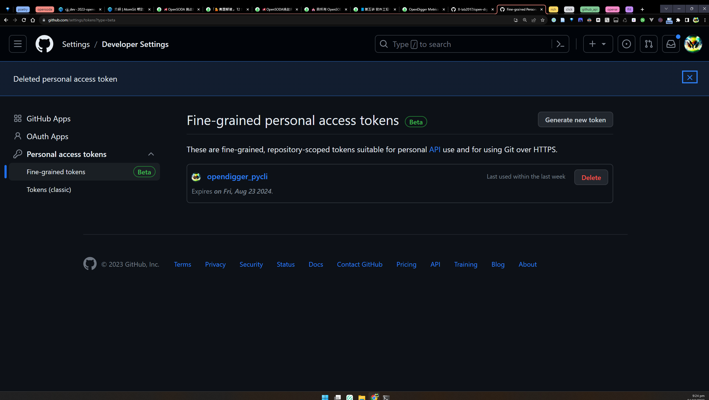

2.设置`Token name`和`Token Expiration`

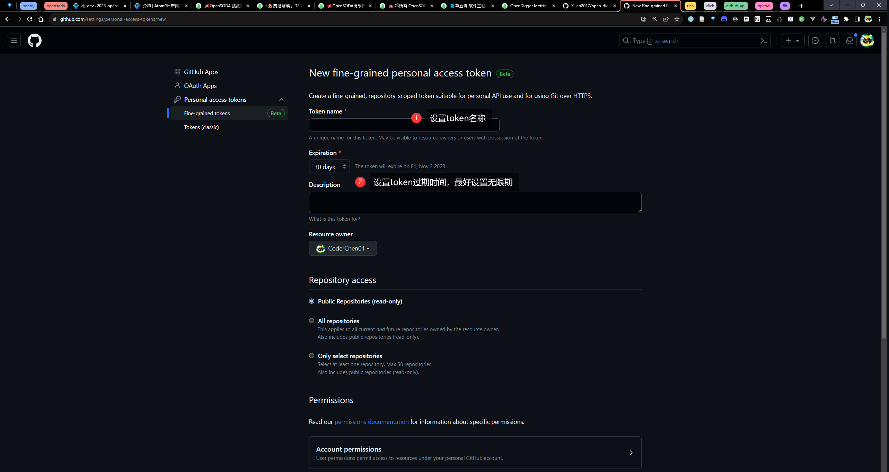

3.选择仓库权限

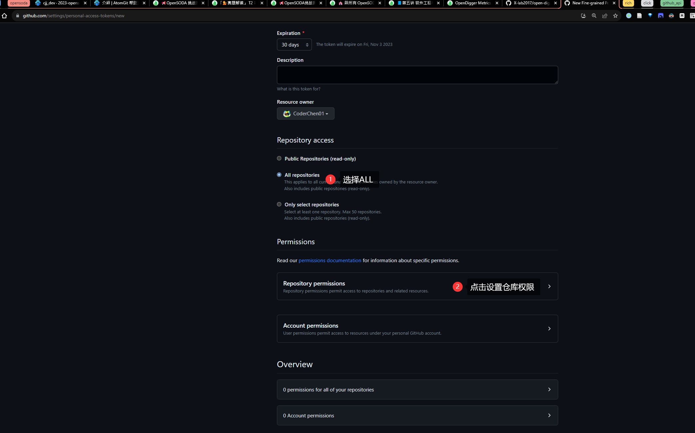

4.设置issue的读写权限

注意metadata权限也必须同时设置只读权限

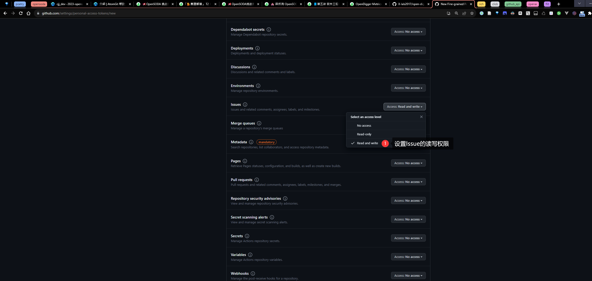

### 获取OpenAI key

OpenAI key用于访问OpenAI API，获取OpenAI API的权限。通过OpenAI API我们可以对指标数据进行分析和生成洞察报告。

[点击这里](https://beta.openai.com/account/api-keys) 获取。

### config 命令

config命令用于配置工具所使用到的第三方API密钥和基本的用户信息。目前工具使用到了Github API和OpenAI API。两者本别用来查询仓库和用户的基本信息，和用来对指标数据进行分析和生成洞察报告。

该命令只有一个参数：

`-s / --set`：用于设置配置项（该参数可以多次使用）

具体使用如下：

```bash
# 配置Github API密钥
opendigger config --set app_keys.github_pat <your_pat>

# 配置OpenAI API密钥
opendigger config -s app_keys.openai_key <your_key>

# 同时配置用户姓名和邮箱
opendigger config -s user_info.name <your_name> -s user_info.email <your_email>
```

<details>
<summary> 演示录屏 </summary>


</details>

### repo 命令

repo命令用于查看仓库的指标数据。该命令有一个参数：

`-r / --repo`：用于指定仓库名称。（该参数可以多次使用）

如果多次指定将会查询多个仓库的指标数据。

该命令单独使用时，将会查询仓库的基本信息。基本信息包括仓库主页链接、仓库Owner主页链接、仓库是否是Fork的和仓库的创建时间与最近更新时间。**通过这些信息可以帮助用户快速了解仓库的基本情况。**

具体使用如下：

```bash
# 查询单个仓库的基本信息
opendigger repo -r X-lab2017/open-digger

# 查询多个仓库的基本信息
opendigger repo -r X-lab2017/open-digger -r microsoft/vscode
```

<details>
<summary> 结果截图 </summary>

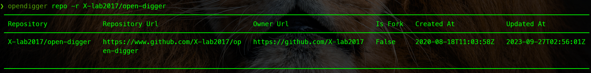

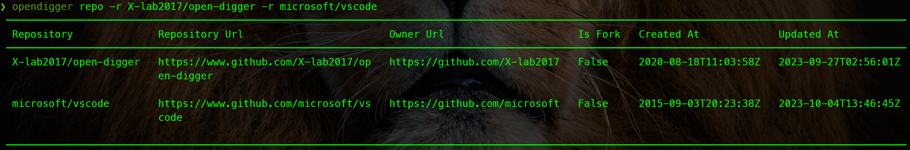
</details>

<details>
<summary> 演示录屏 </summary>


</details>

### user 命令

user命令用于查看用户的指标数据。该命令有一个参数：

`-u / --username`：用于指定用户名。（该参数可以多次使用）

如果多次指定将会查询多个用户的指标数据。

该命令单独使用时，将会查询用户的基本信息。基本信息包括用户名、用户昵称、用户邮箱、用户主页链接、用户创建时间和用户最近更新时间。**通过这些信息可以帮助用户快速了解用户的基本情况。**

具体使用如下：

```bash
# 查询单个用户的基本信息
opendigger user -u CoderChen01

# 查询多个用户的基本信息
opendigger user -u CoderChen01 -u X-lab2017
```

<details>
<summary> 结果截图 </summary>

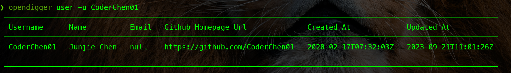

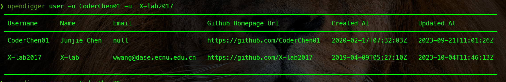
</details>

### query 命令

query命令是`repo`和`user`的子命令(⚠️query命令只能够在`repo`和`user`命令之后使用。)，用于对仓库或用户的指标数据进行筛选。

当前支持的筛选条件有：

- 按类型筛选指标
- 按时间筛选指标数据
- 对某一指标进行筛选
- 正向筛选指标
- 反向筛选指标

query命令的所有参数如下：

```text
-i, --index                     Select indicators whose type is INDEX.
-m, --metric                    Select indicators whose type is METRIC.
-n, --network                   Select indicators whose type is NETWORK.
-x, --x-lab                     Select indicators whose introducer is X-lab.
-c, --chaoss                    Select indicators whose introducer is
                                CHAOSS.
-s, --select INDICATOR_QUERY    The indicator to select.
-o, --only-select / -N, --no-only-select
                                Only query selected indicators.
-I, --ignore IGNORED_INDICATOR_NAMES
                                The indicators to ignore.
-f, --fileter INDICATOR_QUERY   The query applying to all indicators
```

query 命令有两个子命令：

- `display`: 用于将筛选出来的数据以表格、图表或json格式在终端输出。
- `export`: 用于将筛选出来的数据经过GPT分析后导出数据报告或直接导出原始json数据。

> ⚠️ 特别说明
>
> query命令可以理解为是一个数据下载器，它可以根据用户所传参数从opendigger的数据仓库中下载指定的数据。
> 但是**query命令并不会对数据进行处理**，它只是将数据下载到本地。
> 如果用户需要对数据进行处理，可以使用`query`命令的`display`子命令和`export`子命令。如果用户没有在query后使用`display`或`export`子命令，那么query命令将不会对数据进行任何处理，而是只输出筛选指标的基本信息。
> 用户也可以通过我们提供的接口获取query命令下载并筛选后的数据，开发自定义的命令。具体见[🔌插件开发](#插件开发)。

#### 按类型筛选指标

query命令在**不带任何参数**的情况下，可以输出当前支持的**所有指标**的基本信息。基本信息包括指标名称、指标类型、指标引入者和指标数据示例链接。

具体演示如下：

```bash
# 查看仓库指标的基本信息
opendigger repo -r X-lab2017/open-digger query
```

<details>
<summary> 演示录屏 </summary>


</details>

如果我们需要查看某一类型的指标的基本信息，可以使用`-i`、`-m`和`-n`参数。

如果我们需要查看某一引入者的指标的基本信息，可以使用`-x`和`-c`参数。

同时这些指标可以组合使用，例如：

```bash
# 查看指标类型为index的指标的基本信息
opendigger repo -r X-lab2017/open-digger query -i
# 或者
opendigger repo -r X-lab2017/open-digger query --index

# 查看指标类型为metric的指标的基本信息
opendigger repo -r X-lab2017/open-digger query -m

# 查看指标类型为network的指标的基本信息
opendigger repo -r X-lab2017/open-digger query -n

# 查看指标引入者为X-lab的指标的基本信息
opendigger repo -r X-lab2017/open-digger query -x

# 查看指标引入者为CHAOSS的指标的基本信息
opendigger repo -r X-lab2017/open-digger query -c

# 查看指标类型为metric且引入者为X-lab的指标的基本信息
opendigger repo -r X-lab2017/open-digger query -m -x
# 或者
opendigger repo -r X-lab2017/open-digger query -m --x-lab
# 或者
opendigger repo -r X-lab2017/open-digger query -xm
# 或者
opendigger repo -r X-lab2017/open-digger query --metric --x-lab

# 查看指标类型为metric且引入者为CHAOSS的指标的基本信息
opendigger repo -r X-lab2017/open-digger query -m -c
```

如上所示，我们可以通过组合使用`-i`、`-m`、`-n`、`-x`和`-c`参数来查看我们想要的指标的基本信息。这些参数都不接受值，只需要指定即可。

#### 按时间筛选指标数据

通过上述参数我们可以筛选出我们关注的指标类型，然后我们可以通过`-f`参数对筛选出的指标类型的数据进行时间上的筛选。

`-f`参数接受一个指标筛选条件表达式，详细筛选条件表达式见下方：[📄筛选条件表达式详解](#筛选条件表达式详解)。

下面是一些例子（这里为了便于演示将使用`display`子命令将筛选出来的数据在终端以表格形式输出）：

```bash
# 查看仓库X-lab2017/open-digger在2023年的index类型的指标数据，并以表格形式在终端打印
opendigger repo -r X-lab2017/open-digger query -i -f 2023 display -f table

# 查看仓库X-lab2017/open-digger在2021~2023年的index类型的指标数据，并以表格形式在终端打印
opendigger repo -r X-lab2017/open-digger query -i -f 2021~2023 display -f table

# 查看仓库X-lab2017/open-digger在2021年3月~2023年3月的index类型的指标数据，并以表格形式在终端打印
opendigger repo -r X-lab2017/open-digger query -i -f 2021-03~2023-03 display -f table

# 查看仓库X-lab2017/open-digger过去年份3月到8月的index类型的指标数据，并以表格形式在终端打印
opendigger repo -r X-lab2017/open-digger query -i -f 3~8 display -f table

# 查看仓库X-lab2017/open-digger过去年份3月的index类型的指标数据，并以表格形式在终端打印
opendigger repo -r X-lab2017/open-digger query -i -f 3 display -f table
```

<details>
<summary> 演示录屏 </summary>


[query](
    ./docs/assets/demos/repo-query-i-f.gif
)
</details>

#### 对某一指标进行时间筛选

基于`-f`参数我们可以对筛选出的指标进行时间上的过滤，但是如果我们需要针对某一个指标进行筛选该怎么办呢？我们可以通过`-s`参数来对某一个指标指定筛选条件。

`-s`参数接受一个指标查询表达式，该表达式由指标名称和筛选条件表达式组成。指标名称和筛选条件表达式之间用`:`分隔。

下面是一些例子（这里为了便于演示将使用`display`子命令将筛选出来的数据在终端以表格形式输出）：

```bash
# 查看仓库X-lab2017/open-digger的index类型的指标数据，并对openrank指标进行筛选，只查看2023年的数据，并以表格形式在终端打印
opendigger repo -r X-lab2017/open-digger query -i -s openrank:2023 display -f table

# 查看仓库X-lab2017/open-digger的index类型的指标数据，并对openrank指标进行筛选，只查看2021~2022年的数据，并以表格形式在终端打印
opendigger repo -r X-lab2017/open-digger query -i -s openrank:2021~2022 display -f table

# 查看仓库X-lab2017/open-digger的index类型的指标数据，并对openrank指标进行筛选，只查看2021年3月~2022年3月的数据，并以表格形式在终端打印
opendigger repo -r X-lab2017/open-digger query -i -s openrank:2021-03~2022-03 display -f table

# 查看仓库X-lab2017/open-digger的index类型的指标数据，并对openrank指标进行筛选，只查看过去年份3月到8月的数据，并以表格形式在终端打印
opendigger repo -r X-lab2017/open-digger query -i -s openrank:3~8 display -f table

# 查看仓库X-lab2017/open-digger的index类型的指标数据，并对openrank指标进行筛选，只查看过去年份8月的数据，并以表格形式在终端打印
opendigger repo -r X-lab2017/open-digger query -i -s openrank:8 display -f table
```

演示录屏：

<details>
<summary> 查看仓库X-lab2017/open-digger的index类型的指标数据，并对openrank指标进行筛选，只查看2023年的数据，并以表格形式在终端打印 </summary>


</details>

<details>
<summary> 查看仓库X-lab2017/open-digger的index类型的指标数据，并对openrank指标进行筛选，只查看2021~2022年的数据，并以表格形式在终端打印 </summary>


</details>

<details>
<summary> 查看仓库X-lab2017/open-digger的index类型的指标数据，并对openrank指标进行筛选，只查看2021年3月~2022年3月的数据，并以表格形式在终端打印 </summary>


</details>

<details>
<summary> 查看仓库X-lab2017/open-digger的index类型的指标数据，并对openrank指标进行筛选，只查看过去年份3月到8月的数据，并以表格形式在终端打印 </summary>


</details>

<details>
<summary> 查看仓库X-lab2017/open-digger的index类型的指标数据，并对openrank指标进行筛选，只查看过去年份8月的数据，并以表格形式在终端打印 </summary>


</details>

#### 正向筛选指标

我们已经可以对指标通过类型、时间进行筛选并将其在终端以表格形式输出了，并且我们还能针对某一个指标进行时间上的筛选。但是，query命令默认查询所有的指标，即使我们使用了`-i`, `-m`, `-n`, `-x`和`-c`筛选出特定的指标，通过`-f`和`-s`筛选出特定的指标数据，但是我们仍然会得到大量的指标数据，这些指标数据中可能有我们不关心的指标数据。

我们可以通过`-o / --only-select`参数与`-s`参数配合使用，只查询我们关心的指标数据。

比如我们只查询仓库`X-lab2017/open-digger`的`index`类型的指标数据，并且只查询`openrank`指标的数据，我们可以这样做：

```bash
# 只查看过往年份3~8月的openrank指标数据
opendigger repo -r X-lab2017/open-digger query -i -s openrank:3~8 -o display -f table
# 或者
opendigger repo -r X-lab2017/open-digger query -i -s openrank:3~8 --only-select display -f table
# 或者
opendigger repo -r X-lab2017/open-digger query -i -os openrank:3~8 display -f table
```

<details>
<summary> 演示录屏 </summary>


</details>

我们还可以查询多个指标的数据，比如我们还想查看`openrank`和`issue_age`指标的数据，我们可以这样做：

```bash
# 只查看过往年份3~8月的openrank和过往5~8月的issue_age指标数据
opendigger repo -r X-lab2017/open-digger query -s openrank:3~8 -s issue_age:5~8 -o display -f table
```

#### 反向筛选指标

我们还可以通过`-I / --ignore`参数来反向筛选指标，即我们可以通过`-I / --ignore`参数来忽略某些指标。

比如我们只查询仓库`X-lab2017/open-digger`的`index`类型的指标数据，并且忽略`openrank`指标的数据，我们可以这样做：

```bash
opendigger repo -r X-lab2017/open-digger query -i -I openrank display -f table
```

### display 命令

`display`命令是`query`命令的子命令，用于将筛选出来的数据以表格、图表或json格式在终端输出。该命令在上文演示中已经使用过，不过该命令还支持除了table格式的其他格式。具体支持参数如下：

```text
-f, --format [table|graph|json]
                                Display format  [required]
-s, --save DIRECTORY            Save output to file, you can use this option
                                get a simple report
-p, --paging / --no-paging      Page output like more/less command, you
                                CANNOT use this option and save to file at
                                the same time
-c, --pager-color / --no-pager-color
                                Enable color in pager, Only works when
                                paging is enabled
```

可以通过`-f`参数指定输出格式，并且通过`-s / --save`参数可以将终端输出的内容保存到文件(一个简易版的数据报告)中，通过`-p / --paging`参数可以将终端输出的内容分页显示，通过`-c / --pager-color`参数可以在分页显示时启用颜色。

#### 表格格式

表格格式在上文中已经提及，这里不再赘述。

#### 图表格式

图表格式可以将筛选出来的数据以图表的形式在终端输出。目前支持的图表类型有：

- 横向柱状图
- 热力图

具体使用如下：

**查看仓库X-lab2017/open-digger的index类型的openrank指标数据，只查看2023年的数据，并以图表形式在终端打印:**

```bash
opendigger repo -r X-lab2017/open-digger query -i -os openrank:2023 display -f graph
```

结果截图：

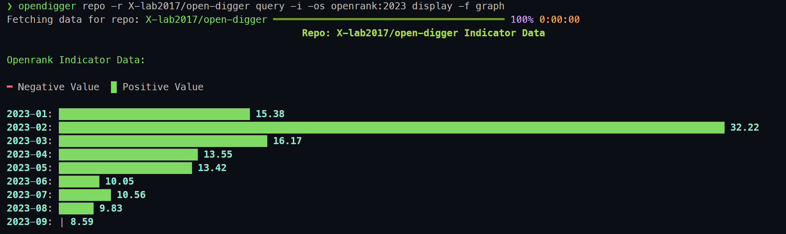

从图中可以看出openrank 2023年每个月的数据变化。

**查看仓库X-lab2017/open-digger的metric类型的active_date_and_time指标数据，只查看2023年的数据，并以图表形式在终端打印:**

```bash
opendigger repo -r X-lab2017/open-digger query -m -os active_date_and_time:2023 display -f graph
```

结果截图：

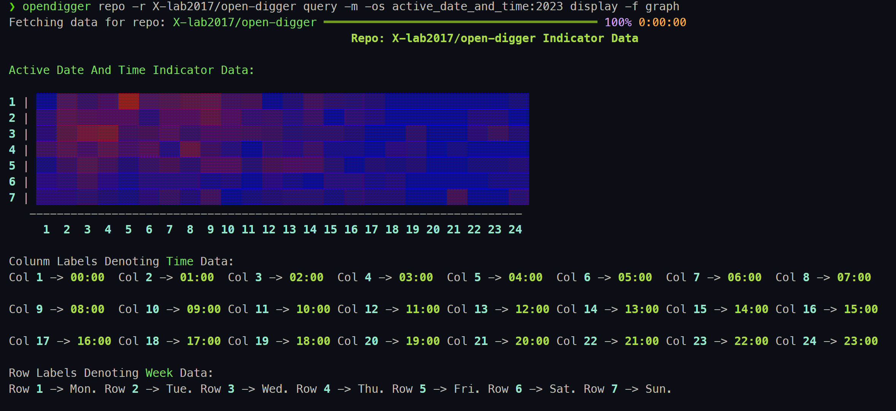

从图中可以看出2023年每个月的活跃时间段。热力图的横纵坐标标号的含义在图下方也会有相应的说明。

**查看仓库X-lab2017/open-digger的metric类型的summed_code_change_line指标数据，并以图表形式在终端打印:**

```bash
opendigger repo -r X-lab2017/open-digger query -m -os summed_code_change_line display -f graph
```

结果截图：

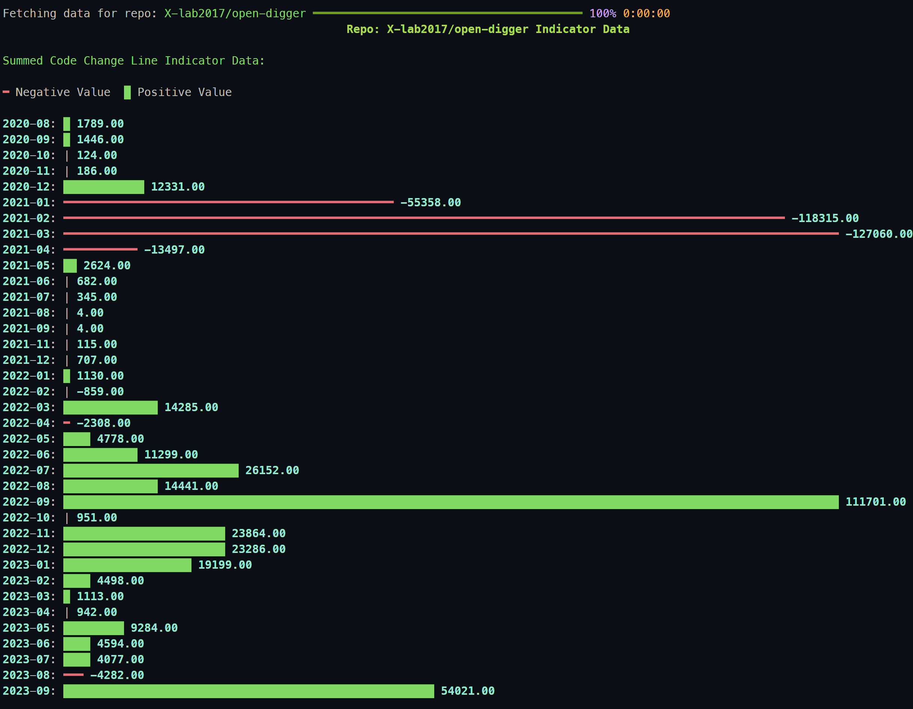

从图中可以看出summed_code_change_line指标的数据变化。对于负值的数据，我们会将其转换为正值，然后在图表中以红色显示。

#### json格式

我们输出的json格式与原数据不一样，我们对原始数据进行了处理，将年月解析了出来并进行了排序，对于包含`-raw`的字段我们也进行了处理。这样用户直接复制打印出来的json数据为自己所用。

具体使用如下：

查看仓库X-lab2017/open-digger的metric类型的issue_age指标数据,并以json格式在终端打印:

```bash
opendigger repo -r X-lab2017/open-digger query -mos issue_age display -f json
```

<details>
<summary> 演示录屏 </summary>


</details>

#### 保存输出结果

我们可以将终端输出的内容保存到文件中，这样我们可以得到一个简易版的数据报告。

比如我们以图表形式输出仓库X-lab2017/open-digger的所有指标数据(除了project_openrank_network指标)，并将输出结果保存到文件中：

```bash
opendigger repo -r X-lab2017/open-digger query display -f graph -s .
```

[演示录屏](./docs/assets/demos/repo-query-dispaly-save.mp4)

### export 命令

`export`命令是`query`命令的子命令，用于将筛选出来的数据经过GPT分析后导出数据报告或直接导出原始json数据。具体支持参数如下：

```text
-f, --format [report|json]  Format to export  [required]
-s, --save-dir DIRECTORY    Directory to save indicators  [required]
--split / --no-split        Save indicators in separate files, ONLY For JSON format
```

可以通过`-f`参数指定输出格式，并且通过`-s / --save-dir`参数可以将数据保存到指定目录中，通过`--split / --no-split`参数可以将数据分别保存到不同的文件中(只对json格式有用)。

#### 数据报告

数据报告是我们对筛选出来的数据进行GPT分析后生成的，该报告包含了筛选出来的数据的分析结果和数据的可视化结果。

具体使用如下：

**查看仓库X-lab2017/open-digger的所有指标数据（除project_openrank_detail指标），并导出数据报告：**

```bash
opendigger repo -r X-lab2017/open-digger query export -f report -s .
```

[演示录屏](./docs/assets/demos/repo-query-export-report.mp4)

**查看仓库X-lab2017/open-digger的所有指标数据(其中查看2023年8月的project_openrank_detail指标，并导出数据报告：**

```bash
open-digger repo -r X-lab2017/open-digger query -s project_openrank_detail:2023-08 export -f report -s .
```

#### 原始Json数据

我们可以将筛选出来的数据导出为原始的json数据，这样用户可以自行处理数据。

具体使用如下：

```bash
# 查看仓库X-lab2017/open-digger的所有指标数据(其中查看2023年8月的project_openrank_detail的指标)，并导出原始json数据
open-digger repo -r X-lab2017/open-digger query -s project_openrank_detail:2023-08 export -f json -s .
```

### 组合使用

query的所有子命令都可以组合使用，比如我们可以先使用`query`命令筛选出我们关心的指标数据，然后使用`display`命令将筛选出来的数据以表格、图表或json格式在终端输出，最后使用`export`命令将筛选出来的数据经过GPT分析后导出数据报告或直接导出原始json数据。如果用户开发了自定义的插件，也可以使用自定义的插件对筛选出来的数据进行处理。

比如我们想要查看仓库`X-lab2017/open-digger`的`index`类型的`openrank`指标数据，并且只查看2023年的数据，并以表格形式在终端打印，最后将筛选出来的数据已json格式导出，我们可以这样做：

```bash
opendigger repo -r X-lab2017/open-digger query -ios openrank:2023 display -f table export -f json -s .
```

结果截图：

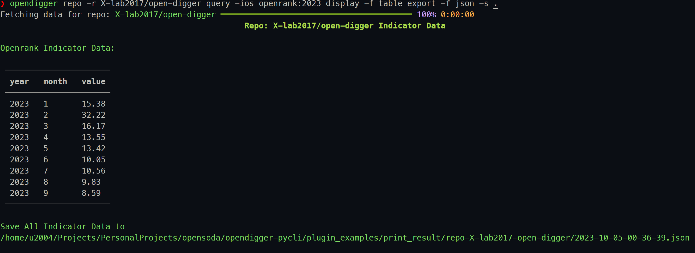

## 👀异常处理

<a id="异常处理"></a>

### 缺失数据自动反馈

open-digger官方仓库对于一些仓库的指标数据是缺失的。用户查询某个仓库的指标数据时，如果该仓库的指标数据缺失，我们会给出相应的提示，并且会使用用户配置的`github personal access token`调用Github API在`opendigger-pycli`的github上自动提交一个数据缺失的issue。

issue信息如图所示：

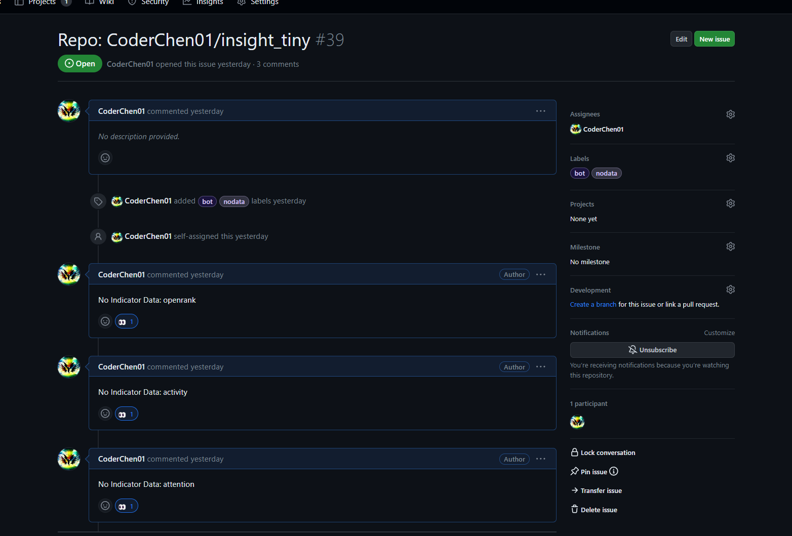

如果多个用户重复查询同一个仓库的指标数据，我们不会冗余的提交，而是在原有的issue上添加一个"👀"符号。这样open-digger开发者可以通过定期查看issue来了解用户关注哪些仓库/用户的哪些指标数据。如果关注人数较多，可以决策是否添加该仓库/用户的指标数据。

### 仓库不存在

如果用户输入的仓库/用户不存在，我们会给出相应的提示。

比如我们输入了一个不存在的仓库`X-lab2017/open-digger-404`，我们会给出相应的提示：

```bash
opendigger repo -r X-lab2017/open-digger-404
```

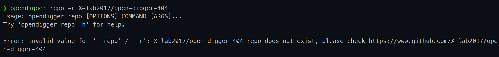

### 用户不存在

如果用户输入的仓库/用户不存在，我们会给出相应的提示。

比如我们输入了一个不存在的用户`CoderChen01-404`，我们会给出相应的提示：

```bash
opendigger user -u CoderChen01-404
```

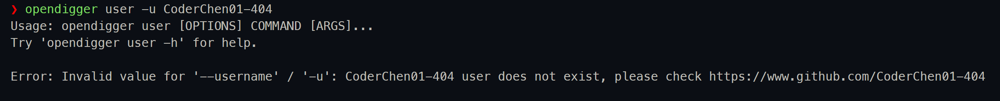

## 🔌插件开发

<a id="插件开发"></a>

插件是opendigger-pycli的一个重要特性，它可以帮助用户快速开发自定义的命令，对筛选出来的数据进行处理。最为重要的就是我们的`query`命令，它利用了`click`库提供的[Mult Command Pipelines](https://click.palletsprojects.com/en/8.1.x/commands/#multi-command-pipelines)特性，可以将筛选出来的数据传递给它的子命令，子命令可以是`display`命令，也可以是用户自定义的命令。

### query的返回数据

```python
@dataclass
class BaseQueryResult:
    type: t.ClassVar[t.Literal["user", "repo"]]
    dataloaders: t.List["DataloaderProto"]
    indicator_queries: t.List[t.Tuple[str, t.Optional["IndicatorQuery"]]]
    uniform_query: t.Optional["IndicatorQuery"]
    data: t.Dict[str, "DataloaderResult"] = field(default_factory=dict, init=False)
    queried_data: t.Dict[str, "DataloaderResult"] = field(
        default_factory=dict, init=False
    )
    failed_query: t.Dict[
        str,
        t.Union[
            t.Optional["IndicatorQuery"],
            t.Dict[str, t.Optional["IndicatorQuery"]],
        ],
    ] = field(default_factory=dict, init=False)


@dataclass
class RepoQueryResult(BaseQueryResult):
    type: t.ClassVar[t.Literal["repo"]] = "repo"
    repo: t.Tuple[str, str]
    org_name: str = field(init=False)
    repo_name: str = field(init=False)

    def __post_init__(self) -> None:
        self.org_name, self.repo_name = self.repo
        run_dataloader(self)
        run_query(self)


@dataclass
class UserQueryResult(BaseQueryResult):
    type: t.ClassVar[t.Literal["user"]] = "user"
    username: str

    def __post_init__(self) -> None:
        run_dataloader(self)
        run_query(self)

```

其中当我们使用`repo`的`query`命令时，`query`命令的返回数据类型为`RepoQueryResult`，当我们使用`user`的`query`命令时，`query`命令的返回数据类型为`UserQueryResult`。

`RepoQueryResult`和`UserQueryResult`都继承自`BaseQueryResult`，`BaseQueryResult`中包含了`query`命令的一些基本信息。

如下是关键属性的介绍（具体用法请见源码：opendigger_pycli/results/display.py）：

- `dataloaders`：`query`命令筛选出的指标的数据加载器。
- `indicator_queries`：`-s`参数指定的指标查询表达式。
- `uniform_query`：`-f`参数指定的指标筛选条件表达式。
- `data`：`query`命令下载的原始数据。
- `queried_data`：`query`命令筛选后的数据。
- `failed_query`：`query`命令筛选失败的指标查询表达式。

### 插件示例

该示例插件的功能是将筛选出来的数据基本信息打印到终端。

示例插件命令代码：

```python
# plugin_example/print_result/print_result.py

from __future__ import annotations
import typing as t
import click

from opendigger_pycli.console import CONSOLE
from opendigger_pycli.utils.decorators import processor


if t.TYPE_CHECKING:
    from opendigger_pycli.results.query import QueryResults


@click.command("print-result", help="[Plugin Demo] Print query result to terminal")
@processor
def print_result(results: QueryResults):
    CONSOLE.print(results)
    yield from results  # 这个yield from是必须的，它会将结果传递给其他子命令。
    
```

模块的安装配置如下：

```python
# plugin_example/print_result/setup.py

from setuptools import setup

setup(
    name="opendigger_pycli_print_result",
    version="0.1",
    py_modules=["print_result"],
    install_requires=[
        "click",
    ],
    entry_points="""
        [opendigger_pycli.plugins]
        print-result=print_result:print_result
    """,
)
```

注意`entry_points`的写法，`opendigger_pycli.plugins`是固定的，`print-result`是插件的名称，`print_result:print_result`定位到插件的入口函数。

具体配置见：[click-plugins](https://github.com/click-contrib/click-plugins/tree/master)

### 示例插件使用

进入示例插件的目录，执行如下命令安装插件：

```bash
cd plugin_example/print_result

python3 setup.py install
```

我们运行如下命令：

```bash
opendigger repo -r X-lab2017/open-digger  query  --help
```

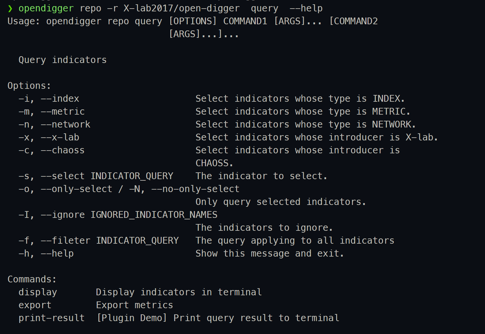

会发现`query`命令的`--help`中多了一个`print-result`子命令。

我们运行如下命令：

```bash
opendigger repo -r X-lab2017/open-digger  query -ios openrank:2023 print-result
```

结果如下：

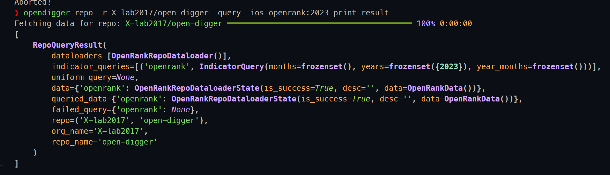

## 📄筛选条件表达式详解

<a id="筛选条件表达式详解"></a>

筛洗条件表达式主要分为如下几种：

- 年份查询
- 月份查询
- 年月查询
- 年月范围查询
- 年份范围查询
- 年份月份范围查询

我们使用~来表示范围，使用-来表示年月。

通过如下几个示例来说明：

查询2023年的数据：

```bash
opendigger repo -r X-lab2017/open-digger query -ios openrank -f 2023 display -f table
```

查询2021年到2023年的数据：

```bash
opendigger repo -r X-lab2017/open-digger query -ios openrank -f 2021~2023 display -f table
```

查询过往年份3月的数据：

```bash
opendigger repo -r X-lab2017/open-digger query -ios openrank -f 3 display -f table
```

查询过往年份3月到8月的数据：

```bash
opendigger repo -r X-lab2017/open-digger query -ios openrank -f 3~8 display -f table
```

查询2023年3月的数据：

```bash
opendigger repo -r X-lab2017/open-digger query -ios openrank -f 2023-03 display -f table
```

查询2022年3月到2023年3月的数据：

```bash
opendigger repo -r X-lab2017/open-digger query -ios openrank -f 2022-03~2023-03 display -f table
```

## End

GPT 分析报告DEMO见：[./docs/assets/result_examples/export/report/repo-X-lab2017-open-digger](./docs/assets/result_examples/export/report/repo-X-lab2017-open-digger/)

更多功能等待您的探索...
