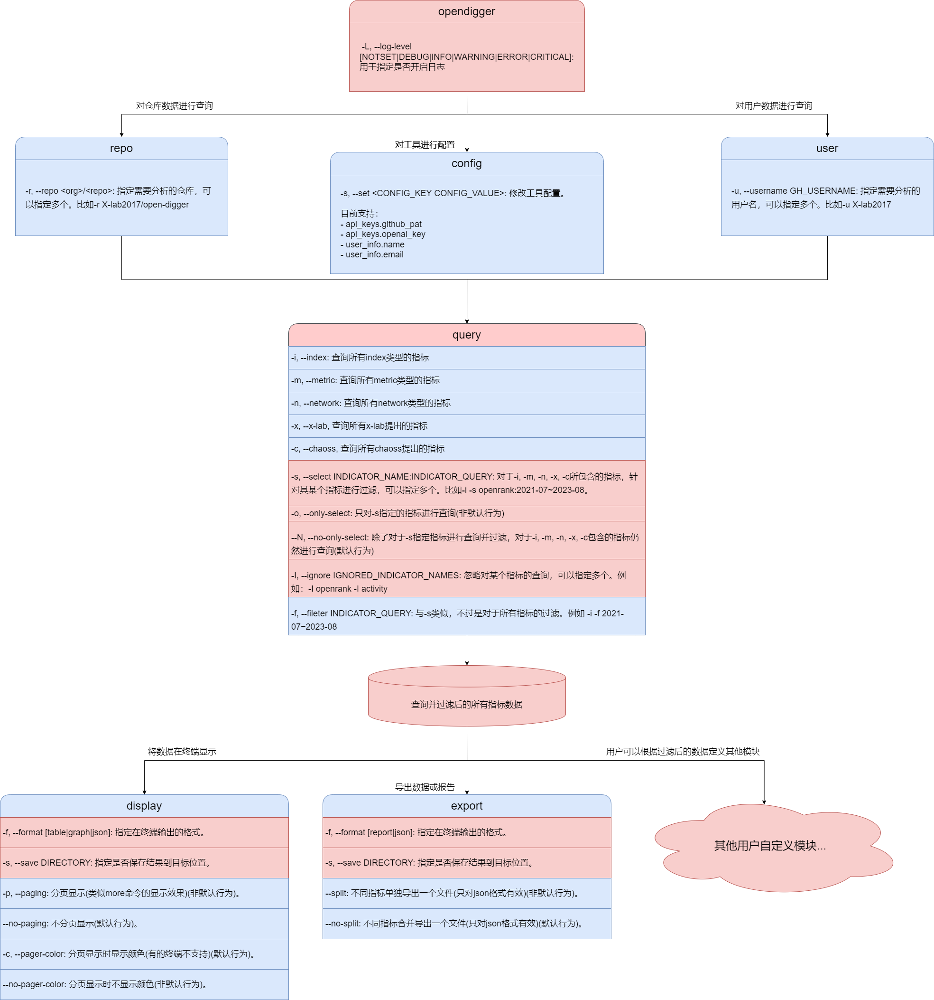
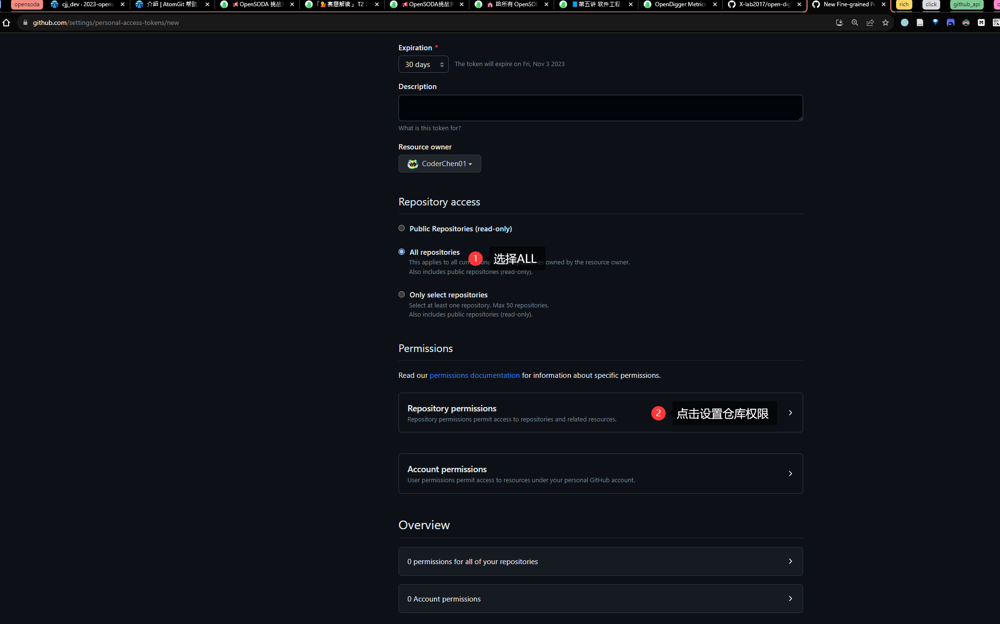

# OpenDigger CLI 文档




## 🪛安装

### 基本环境

Python >= 3.8

### 从源码安装

```bash
git clone https://github.com/CoderChen01/opendigger-pycli.git
```

### 从PyPI安装

```bash
pip3 install opendigger_pycli
```

## 🕹️基本用法

### 获取Github Personal Access Token

[点击这里](https://github.com/settings/tokens?type=beta) 获取。

具体步骤：

1.点击`Fine-grained tokens` > 点击`Generate new token`


2.设置`Token name`和`Token Expiration`


3.选择仓库权限



4.设置issue的读写权限

注意metadata权限也必须同时设置只读权限


### 获取OpenAI key

自行搜索教程

### config 命令

config命令用于配置工具所使用到的第三方API密钥和基本的用户信息。目前工具使用到了Github API和OpenAI API。两者本别用来查询仓库和用户的基本信息，和用来对指标数据进行分析和生成洞察报告。

该命令只有一个参数：

`-s / --set`：用于设置配置项（该参数可以多次使用）

具体使用如下：

```bash
# 配置Github API密钥
opendigger config --set app_keys.github_pat <your_pat>

# 配置OpenAI API密钥
opendigger config -s app_keys.openai_key <your_key>

# 同时配置用户姓名和邮箱
opendigger config -s user_info.name <your_name> -s user_info.email <your_email>
```

<details>
<summary> 演示录屏 </summary>


</details>

### repo 命令

repo命令用于查看仓库的指标数据。该命令有一个参数：

`-r / --repo`：用于指定仓库名称。（该参数可以多次使用）

如果多次指定将会查询多个仓库的指标数据。

该命令单独使用时，将会查询仓库的基本信息。基本信息包括仓库主页链接、仓库Owner主页链接、仓库是否是Fork的和仓库的创建时间与最近更新时间。**通过这些信息可以帮助用户快速了解仓库的基本情况。**

具体使用如下：

```bash
# 查询单个仓库的基本信息
opendigger repo -r X-lab2017/open-digger

# 查询多个仓库的基本信息
opendigger repo -r X-lab2017/open-digger -r microsoft/vscode
```

<details>
<summary> 结果截图 </summary>


</details>

<details>
<summary> 演示录屏 </summary>


</details>

### user 命令

user命令用于查看用户的指标数据。该命令有一个参数：

`-u / --username`：用于指定用户名。（该参数可以多次使用）

如果多次指定将会查询多个用户的指标数据。

该命令单独使用时，将会查询用户的基本信息。基本信息包括用户名、用户昵称、用户邮箱、用户主页链接、用户创建时间和用户最近更新时间。**通过这些信息可以帮助用户快速了解用户的基本情况。**

具体使用如下：

```bash
# 查询单个用户的基本信息
opendigger user -u CoderChen01

# 查询多个用户的基本信息
opendigger user -u CoderChen01 -u X-lab2017
```

<details>
<summary> 结果截图 </summary>


</details>

### query 命令

query命令是`repo`和`user`的子命令(⚠️query命令只能够在`repo`和`user`命令之后使用。)，用于对仓库或用户的指标数据进行筛选。

当前支持的筛选条件有：

- 按类型筛选指标
- 按时间筛选指标数据
- 对某一指标进行筛选
- 正向筛选指标
- 反向筛选指标

query命令的所有参数如下：

```text
-i, --index                     Select indicators whose type is INDEX.
-m, --metric                    Select indicators whose type is METRIC.
-n, --network                   Select indicators whose type is NETWORK.
-x, --x-lab                     Select indicators whose introducer is X-lab.
-c, --chaoss                    Select indicators whose introducer is
                                CHAOSS.
-s, --select INDICATOR_QUERY    The indicator to select.
-o, --only-select / -N, --no-only-select
                                Only query selected indicators.
-I, --ignore IGNORED_INDICATOR_NAMES
                                The indicators to ignore.
-f, --fileter INDICATOR_QUERY   The query applying to all indicators
```

query 命令有两个子命令：

- `display`: 用于将筛选出来的数据以表格、图表或json格式在终端输出。
- `export`: 用于将筛选出来的数据经过GPT分析后导出数据报告或直接导出原始json数据。

> ⚠️ 特别说明
>
> query命令可以理解为是一个数据下载器，它可以根据用户所传参数从opendigger的数据仓库中下载指定的数据。
> 但是**query命令并不会对数据进行处理**，它只是将数据下载到本地。
> 如果用户需要对数据进行处理，可以使用`query`命令的`display`子命令和`export`子命令。如果用户没有在query后使用`display`或`export`子命令，那么query命令将不会对数据进行任何处理，而是只输出筛选指标的基本信息。
> 用户也可以通过我们提供的接口获取query命令下载并筛选后的数据，开发自定义的命令。具体见[🔌插件开发](#plugin-system)。

#### 按类型筛选指标

query命令在**不带任何参数**的情况下，可以输出当前支持的**所有指标**的基本信息。基本信息包括指标名称、指标类型、指标引入者和指标数据示例链接。

具体演示如下：

```bash
# 查看仓库指标的基本信息
opendigger repo -r X-lab2017/open-digger query
```

<details>
<summary> 演示录屏 </summary>


</details>

如果我们需要查看某一类型的指标的基本信息，可以使用`-i`、`-m`和`-n`参数。

如果我们需要查看某一引入者的指标的基本信息，可以使用`-x`和`-c`参数。

同时这些指标可以组合使用，例如：

```bash
# 查看指标类型为index的指标的基本信息
opendigger repo -r X-lab2017/open-digger query -i
# 或者
opendigger repo -r X-lab2017/open-digger query --index

# 查看指标类型为metric的指标的基本信息
opendigger repo -r X-lab2017/open-digger query -m

# 查看指标类型为network的指标的基本信息
opendigger repo -r X-lab2017/open-digger query -n

# 查看指标引入者为X-lab的指标的基本信息
opendigger repo -r X-lab2017/open-digger query -x

# 查看指标引入者为CHAOSS的指标的基本信息
opendigger repo -r X-lab2017/open-digger query -c

# 查看指标类型为metric且引入者为X-lab的指标的基本信息
opendigger repo -r X-lab2017/open-digger query -m -x
# 或者
opendigger repo -r X-lab2017/open-digger query -m --x-lab
# 或者
opendigger repo -r X-lab2017/open-digger query -xm
# 或者
opendigger repo -r X-lab2017/open-digger query --metric --x-lab

# 查看指标类型为metric且引入者为CHAOSS的指标的基本信息
opendigger repo -r X-lab2017/open-digger query -m -c
```

如上所示，我们可以通过组合使用`-i`、`-m`、`-n`、`-x`和`-c`参数来查看我们想要的指标的基本信息。这些参数都不接受值，只需要指定即可。

#### 按时间筛选指标数据

通过上述参数我们可以筛选出我们关注的指标类型，然后我们可以通过`-f`参数对筛选出的指标类型的数据进行时间上的筛选。

`-f`参数接受一个指标筛选条件表达式，详细筛选条件表达式见下方：[📄筛选条件表达式详解](#indicator-query)。

下面是一些例子（这里为了便于演示将使用`display`子命令将筛选出来的数据在终端以表格形式输出）：

```bash
# 查看仓库X-lab2017/open-digger在2023年的index类型的指标数据，并以表格形式在终端打印
opendigger repo -r X-lab2017/open-digger query -i -f 2023 display -f table

# 查看仓库X-lab2017/open-digger在2021~2023年的index类型的指标数据，并以表格形式在终端打印
opendigger repo -r X-lab2017/open-digger query -i -f 2021~2023 display -f table

# 查看仓库X-lab2017/open-digger在2021年3月~2023年3月的index类型的指标数据，并以表格形式在终端打印
opendigger repo -r X-lab2017/open-digger query -i -f 2021-03~2023-03 display -f table

# 查看仓库X-lab2017/open-digger过去年份3月到8月的index类型的指标数据，并以表格形式在终端打印
opendigger repo -r X-lab2017/open-digger query -i -f 3~8 display -f table

# 查看仓库X-lab2017/open-digger过去年份3月的index类型的指标数据，并以表格形式在终端打印
opendigger repo -r X-lab2017/open-digger query -i -f 3 display -f table
```

<details>
<summary> 演示录屏 </summary>


[query](
    ./assets/demos/repo-query-i-f.gif
)
</details>

#### 对某一指标进行时间筛选

基于`-f`参数我们可以对筛选出的指标进行时间上的过滤，但是如果我们需要针对某一个指标进行筛选该怎么办呢？我们可以通过`-s`参数来对某一个指标指定筛选条件。

`-s`参数接受一个指标查询表达式，该表达式由指标名称和筛选条件表达式组成。指标名称和筛选条件表达式之间用`:`分隔。

下面是一些例子（这里为了便于演示将使用`display`子命令将筛选出来的数据在终端以表格形式输出）：

```bash
# 查看仓库X-lab2017/open-digger的index类型的指标数据，并对openrank指标进行筛选，只查看2023年的数据，并以表格形式在终端打印
opendigger repo -r X-lab2017/open-digger query -i -s openrank:2023 display -f table

# 查看仓库X-lab2017/open-digger的index类型的指标数据，并对openrank指标进行筛选，只查看2021~2022年的数据，并以表格形式在终端打印
opendigger repo -r X-lab2017/open-digger query -i -s openrank:2021~2022 display -f table

# 查看仓库X-lab2017/open-digger的index类型的指标数据，并对openrank指标进行筛选，只查看2021年3月~2022年3月的数据，并以表格形式在终端打印
opendigger repo -r X-lab2017/open-digger query -i -s openrank:2021-03~2022-03 display -f table

# 查看仓库X-lab2017/open-digger的index类型的指标数据，并对openrank指标进行筛选，只查看过去年份3月到8月的数据，并以表格形式在终端打印
opendigger repo -r X-lab2017/open-digger query -i -s openrank:3~8 display -f table

# 查看仓库X-lab2017/open-digger的index类型的指标数据，并对openrank指标进行筛选，只查看过去年份8月的数据，并以表格形式在终端打印
opendigger repo -r X-lab2017/open-digger query -i -s openrank:8 display -f table
```

演示录屏：

<details>
<summary> 查看仓库X-lab2017/open-digger的index类型的指标数据，并对openrank指标进行筛选，只查看2023年的数据，并以表格形式在终端打印 </summary>


</details>

<details>
<summary> 查看仓库X-lab2017/open-digger的index类型的指标数据，并对openrank指标进行筛选，只查看2021~2022年的数据，并以表格形式在终端打印 </summary>


</details>

<details>
<summary> 查看仓库X-lab2017/open-digger的index类型的指标数据，并对openrank指标进行筛选，只查看2021年3月~2022年3月的数据，并以表格形式在终端打印 </summary>


</details>

<details>
<summary> 查看仓库X-lab2017/open-digger的index类型的指标数据，并对openrank指标进行筛选，只查看过去年份3月到8月的数据，并以表格形式在终端打印 </summary>


</details>

<details>
<summary> 查看仓库X-lab2017/open-digger的index类型的指标数据，并对openrank指标进行筛选，只查看过去年份8月的数据，并以表格形式在终端打印 </summary>


</details>

#### 正向筛选指标

#### 反向筛选指标

### display 命令

#### 表格格式

#### 图表格式

#### json格式

### export 命令

#### 数据报告

#### 原始Json数据

### 组合使用

## 🔌插件开发 <a id="plugin-system"></a>

## 📄筛选条件表达式详解 <a id="indicator-query"></a>
